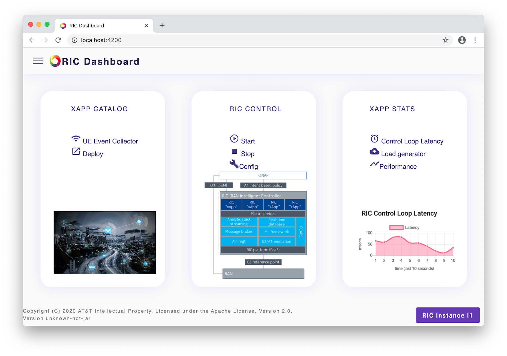
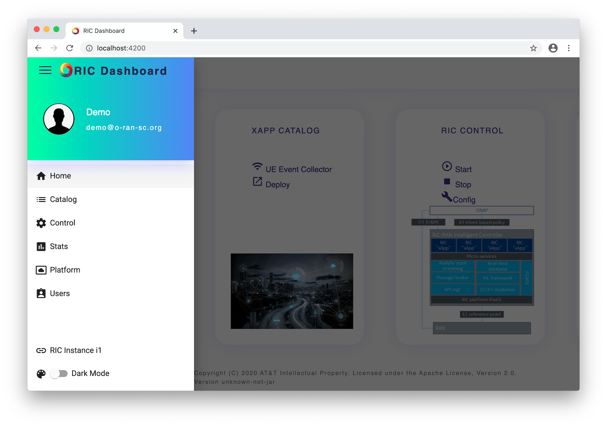
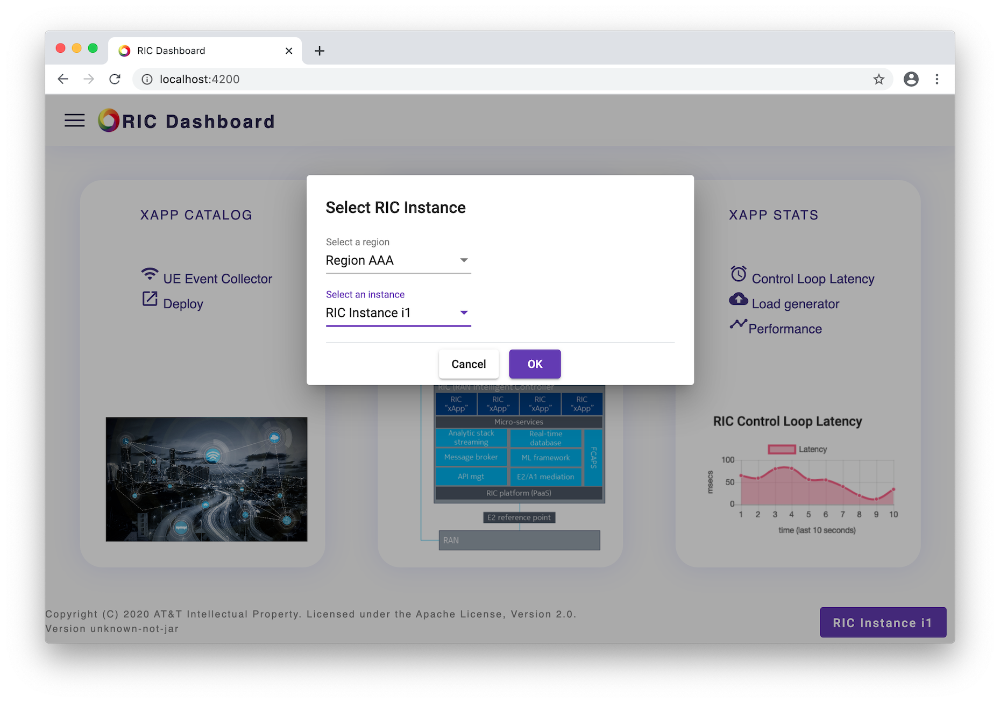
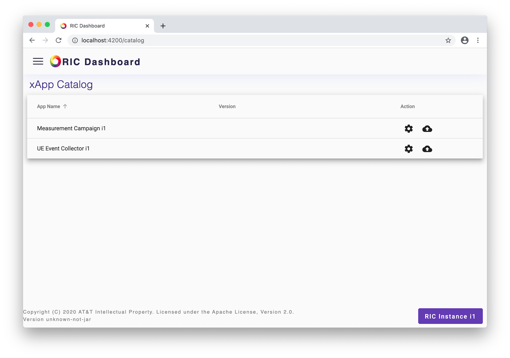
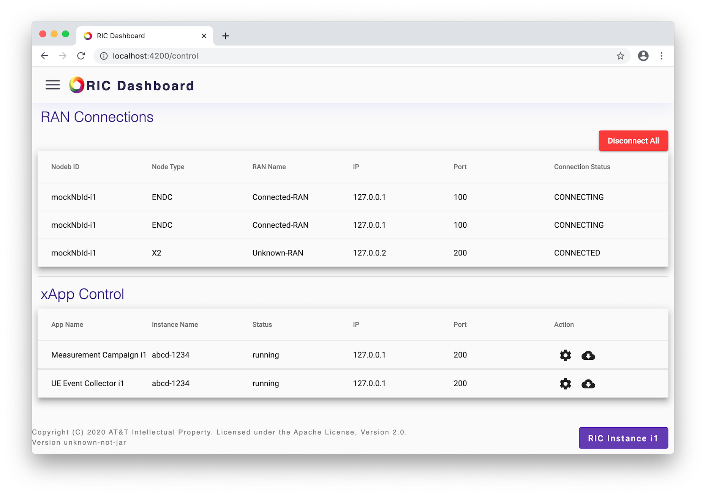
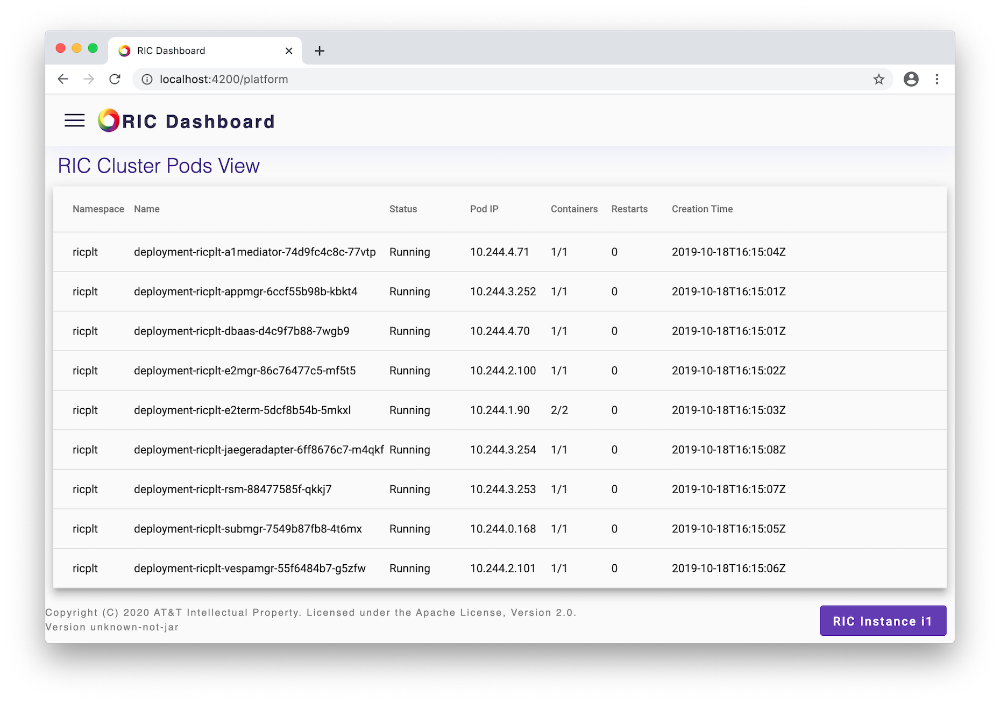
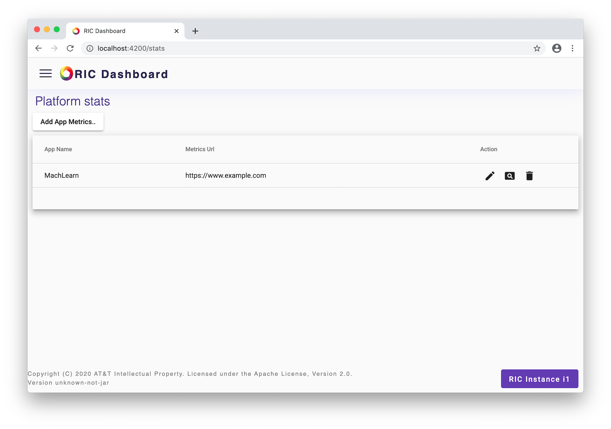

.. This work is licensed under a Creative Commons Attribution 4.0 International License.
.. SPDX-License-Identifier: CC-BY-4.0
.. Copyright (C) 2020 AT&T Intellectual Property

RIC Dashboard User Guide
========================

This document provides a quickstart for users of the O-RAN SC RIC
Dashboard web application.

Main Page
---------

The main (home) page has tiles for catalog, control and application
statistics, which are the main three areas of the Dashboard. A screen
shot of the main page is shown below.

Left Menu
---------

Items on the left menu give access to all features of the RIC
Dashboard A screen shot of the menu is shown below.

xRIC Instances
-------------

The Dashboard can be configured to manage multiple RIC instances.
Instances are grouped into regions.  Users can select the instance to
manage by clicking on the button shown at the bottom right of the main
page, which brings up the dialog shown below.

xApp Catalog
------------

The catalog page shows all the applications that can be deployed to
the RIC.  Users may change static settings or deploy an application
form this page.  A sample screen shot is shown below.

RIC Control
-----------

The control page shows the current RAN connections and the
applications deployed to the RIC. Users may disconnect the RIC, adjust
dynamic application settings and undeploy applications.  A sample
screen shot is shown below.

Platform Status
---------------

The cluster pods view shows the Kubernetes pod details. A sample
screen shot is shown below.

Platform Statistic Views
------------------------

The stats page allows configuration of views that analyze and display
statistics gathered by a remote system for applications deployed to
the RIC. Users may add or remove views.  A sample screen shot is shown
below.

